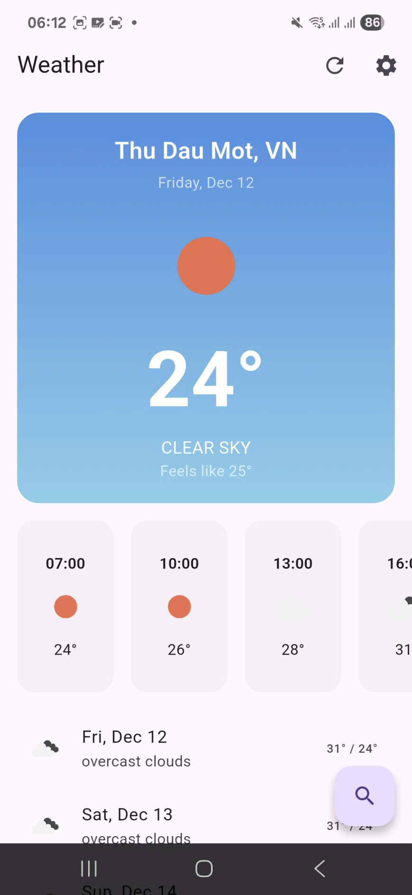

## 👤 Thông tin

- Họ tên: Đặng Thị Bích Thủy
- MSSV: 2224801030342

# Flutter Weather App

Ứng dụng thời tiết viết bằng **Flutter**, sử dụng API **OpenWeatherMap** để hiển thị:
- Thời tiết hiện tại theo **vị trí GPS** hoặc **tên thành phố**
- Dự báo thời tiết theo giờ/ngày (từ API forecast)
- Caching dữ liệu để dùng **offline**
- Tìm kiếm và xem lại **thành phố đã tìm**

---

## Tính năng chính

### 1. Thời tiết hiện tại
- Nhiệt độ hiện tại (°C / metric)
- Feels like (cảm giác như)
- Tình trạng thời tiết + icon (Clear, Rain, Clouds,…)
- Tên thành phố, quốc gia
- Ngày, giờ hiện tại
- Mô tả thời tiết (vd: clear sky, light rain,…)

### 2. Chi tiết thời tiết
- Độ ẩm (humidity)
- Tốc độ gió (wind speed)
- Áp suất khí quyển (pressure)
- Tầm nhìn (visibility)
- Độ mây che phủ (cloudiness)

### 3. Dự báo (Forecast)
- Dự báo 5 ngày thông qua endpoint `/forecast`
- Nhiệt độ theo từng mốc thời gian
- Mô tả thời tiết + icon cho từng mốc

### 4. Location & Search
- Tự động lấy vị trí hiện tại bằng **Geolocator**
- Lấy tên thành phố từ toạ độ qua **Geocoding**
- Tìm kiếm thời tiết theo **tên thành phố**
- Có thể dùng thành phố tìm kiếm để load forecast

### 5. Offline & Caching
- Lưu dữ liệu thời tiết mới nhất vào `SharedPreferences`
- Khi offline hoặc lỗi API, app có thể:
  - Hiển thị dữ liệu cache (nếu có)
  - Hiện thông báo lỗi thân thiện

### 6. Trạng thái UI
- Loading state khi đang gọi API
- Error state khi:
  - Sai tên thành phố
  - Sai API key
  - Hết rate limit
  - Lỗi mạng
- Pull-to-refresh để refresh thời tiết hiện tại

---

## Công nghệ & thư viện sử dụng

- Flutter
- `http` – gọi REST API
- `geolocator` – lấy GPS location
- `geocoding` – chuyển toạ độ → tên thành phố
- `provider` – state management (`WeatherProvider`, `LocationProvider`)
- `shared_preferences` – cache dữ liệu thời tiết
- `intl` – format ngày giờ
- `cached_network_image` – hiển thị icon thời tiết từ URL
- `flutter_dotenv` – quản lý API key qua file `.env`
- `connectivity_plus` – kiểm tra trạng thái mạng (nếu dùng)

---

## Cấu trúc thư mục (chính)

```text
lib/
  main.dart

  config/
    api_config.dart

  models/
    weather_model.dart
    forecast_model.dart
    location_model.dart
    hourly_weather_model.dart

  services/
    weather_service.dart
    location_service.dart
    storage_service.dart
    connectivity_service.dart

  providers/
    weather_provider.dart
    location_provider.dart

  screens/
    home_screen.dart
    search_screen.dart
    forecast_screen.dart
    settings_screen.dart

  widgets/
    current_weather_card.dart
    hourly_forecast_list.dart
    daily_forecast_card.dart
    weather_detail_item.dart
    loading_shimmer.dart
    error_widget.dart

  utils/
    constants.dart
    weather_icons.dart
    date_formatter.dart
```

---

## ☁️ API sử dụng

### OpenWeatherMap

- Trang chủ: https://openweathermap.org
- API docs: https://openweathermap.org/api

Endpoint chính:
- **Current weather**: `/data/2.5/weather`
- **5-day forecast**: `/data/2.5/forecast`

App sử dụng `WeatherService` để:
- `getCurrentWeatherByCity(city)`
- `getCurrentWeatherByCoordinates(lat, lon)`
- `getForecast(city)`

---

## Cấu hình API key

1. Tạo tài khoản và API key tại:  
   https://home.openweathermap.org/users/sign_up

2. Tạo file `.env` ở thư mục root:

```env
OPENWEATHER_API_KEY=your_real_api_key_here
```

3. Đảm bảo `.env` KHÔNG bị commit:

```gitignore
.env
*.env
```

4. Trong code, API key được đọc thông qua `flutter_dotenv` hoặc truyền vào `WeatherService`.

---

## ▶Cài đặt & chạy ứng dụng

### 1. Cài dependencies

```bash
flutter pub get
```

### 2. Chạy trên emulator / device

```bash
flutter run
```

Chọn thiết bị bạn muốn chạy (Android emulator, iOS simulator hoặc device thật).

---

## Unit Test

Project có một số test đơn giản cho:

- **`WeatherModel`**: parse JSON → model
- **`WeatherService`**: xử lý các trường hợp:
  - 200 OK → trả về `WeatherModel`
  - 404 → ném exception `"City not found"`
  - 401 → ném exception `"Invalid API key"`
  - 429 → ném exception `"Rate limit exceeded, please try later"`
  - Lỗi mạng → ném `Exception`

Chạy toàn bộ test:

```bash
flutter test
```

---

## 🖼 Screenshots 





